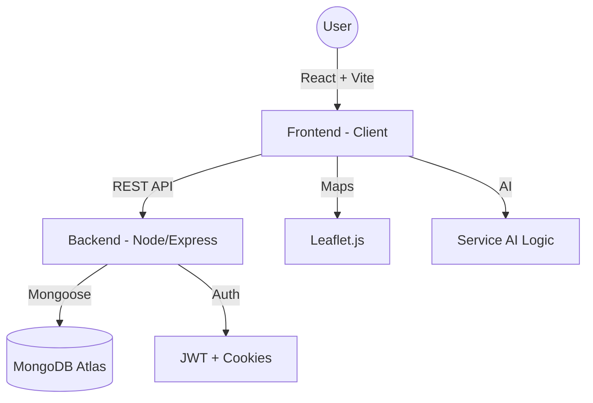

# 🏘️ ServiceHub: Your Neighbourhood Service Marketplace

> **We built a scalable platform to solve local service discovery with instant booking.**

---

### ✅ Hackathon Checklist Completion
- [x] **Authentication**: Secure Register/Login flow with JWT.
- [x] **Search & Filter**: Advanced discovery by category and keyword.
- [x] **Database Models**: Fully aligned with User, Service, Booking, and Review architecture.
- [x] **Booking System**: end-to-end flow with state management.
- [x] **Provider Dashboard**: Real-time management of jobs and status.
- [x] **Review System**: Trust-based feedback loop with ratings.
- [x] **Winning Features**: Map View 📍, AI Assistant 🤖, Real-time tracking ⏱️.

---


## ✨ Features that WOW

### 🤖 AI-Powered Service Assistant
Don't know what you need? Just describe your problem to our **Integrated AI Assistant**. It understands natural language like *"My AC is making a weird rattling noise"* and instantly suggests the right category and top experts.

### 📍 Interactive Neighbourhood Map
Visualize the experts near you! Our **Leaflet-integrated Map View** allows you to see service providers' locations in real-time, emphasizing the *"local"* in local services.

### ⏱️ Real-Time Status Tracking
From the moment you book to the final handshake, track your service status with a **Visual Timeline**. 
- *Booking Placed* → *Confirmed* → *Provider on the Way* → *Service Finished*.

### 💎 Premium Aesthetic
Built with a "Mobile-First" philosophy, featuring **Glassmorphism**, **Mesh Gradients**, and **Smooth Framer Motion** transitions for a premium, high-end user experience.

---

## 🏗️ Architecture



---

## 🛠️ Tech Stack

- **Frontend**: React 18, TypeScript, Vite, Tailwind CSS, Framer Motion, Lucide Icons, Radix UI.
- **Backend**: Node.js, Express, MongoDB, Mongoose, JWT, Cookie-parser.
- **Map Engine**: Leaflet.js + OpenStreetMap.
- **Styling**: Modern CSS with Glassmorphism and Custom Design System.

---

## 🚀 Getting Started

### Prerequisites
- Node.js (v18+)
- MongoDB (Running locally or Atlas URI)

### Installation

1. **Clone the Repo**
   ```bash
   git clone <repo-url>
   cd Neighbourhood_Service_Marketplace
   ```

2. **Run the Magic Install**
   We've simplified dependency management for you!
   ```bash
   npm run install-all
   ```

3. **Environment Setup**
   Create a `.env` file in the `backend` folder:
   ```env
   MONGO_URI=your_mongodb_uri
   JWT_SECRET=your_super_secret_key
   PORT=5000
   ```

4. **Launch the Engine**
   ```bash
   npm start
   ```
   Both Frontend (3000) and Backend (5000) will start concurrently!

---

## 🏆 Why ServiceHub Wins?

1. **Local Relevance**: Focuses on "Neighbourhood" pulse, not just city-wide.
2. **Trust-First**: Designed with verification and reviews at the core.
3. **Advanced UX**: Interactive maps and AI assistants make it feel like a 2024+ product.
4. **Clean Code**: Modular, typed, and scalable architecture.

---

## 👥 Contributors
- **Kishan Kumar** - Lead Innovation & Full Stack Developer

Developed for the [Hackathon Name] 2026.